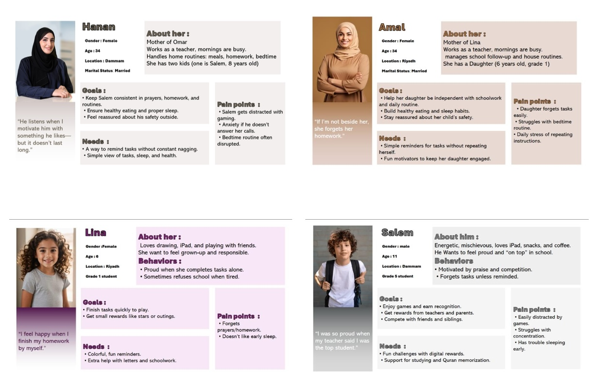
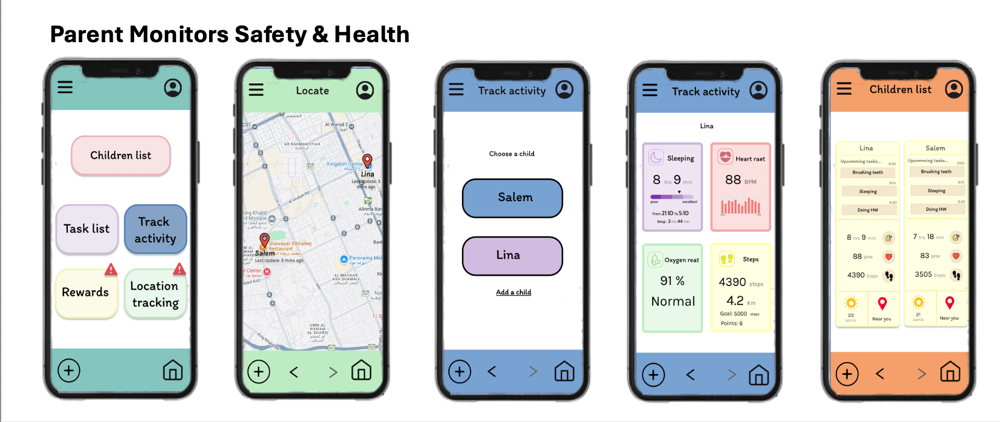
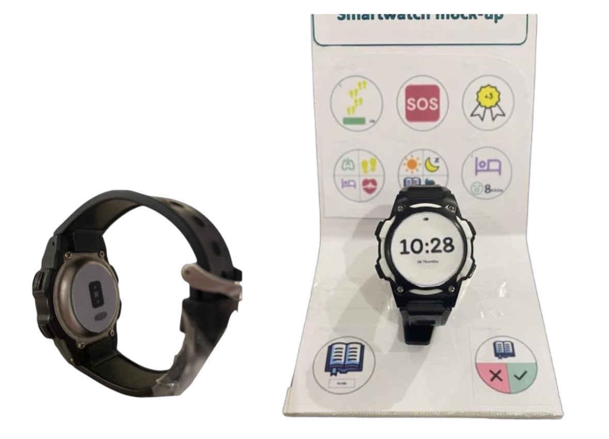

# daily buddy – ux design & prototype

daily buddy is a user-centered ux design project that helps children (ages 6–12) build healthy daily routines while reducing parental stress. it combines a parent mobile app with a connected smartwatch interface for children, enabling task management, motivation, health tracking, and safety in one ecosystem.

---

## 📌 overview

daily buddy was designed through a complete ux process including research, ideation, prototyping, and usability testing.

the goal is to support children’s independence while giving parents visibility and reassurance.

### problem space
- children forgetting daily routines
- over-reliance on parental reminders
- low motivation for healthy habits
- parental concerns about safety

---

## 🎨 figma prototype

the interactive prototype was designed in figma and demonstrates key user flows for both parents and children.

🔗 view prototype:  
https://www.figma.com/design/xgP9rlaYINTQazG6yLSAo9/DailyBuddy?t=O9o2S17exEyDWpXG-1

---

## 🔍 user research

research was conducted through interviews, questionnaires, and behavioral analysis.

key insights:
- children respond strongly to rewards and visual feedback
- parents need real-time reassurance and tracking
- simplicity is critical for child-focused design

---

## 👤 personas

personas represent both parent and child user groups and guided design decisions across the project.

---

## 🧭 design process

- user flows and task analysis
- storyboarding
- low-fidelity wireframes
- high-fidelity wireframes
- iterative design improvements

---

## 💻 software prototype (parent app)

the parent app allows task creation, monitoring, progress tracking, and safety oversight.

---

## ⌚ hardware prototype (child smartwatch)

the smartwatch interface supports task reminders, rewards, health tracking, and emergency alerts in a simple child-friendly design.

---

## 🧪 usability testing

testing was conducted using the think-aloud method with parent-child participants.

focus areas:
- task completion success
- navigation clarity
- error frequency
- user satisfaction

findings were used to refine flows and improve usability across both platforms.

---

## 🎯 key features

- daily task scheduling with reminders
- reward-based motivation system
- smartwatch integration for children
- health tracking (steps, sleep, heart rate, oxygen level)
- real-time location tracking and alerts

---

## 📄 documentation

full project documentation is available in the attached pdf, including research, personas, design decisions, and usability findings.

---

## 🎓 academic context

it214 – user experience  
king saud university – college of computer and information sciences
